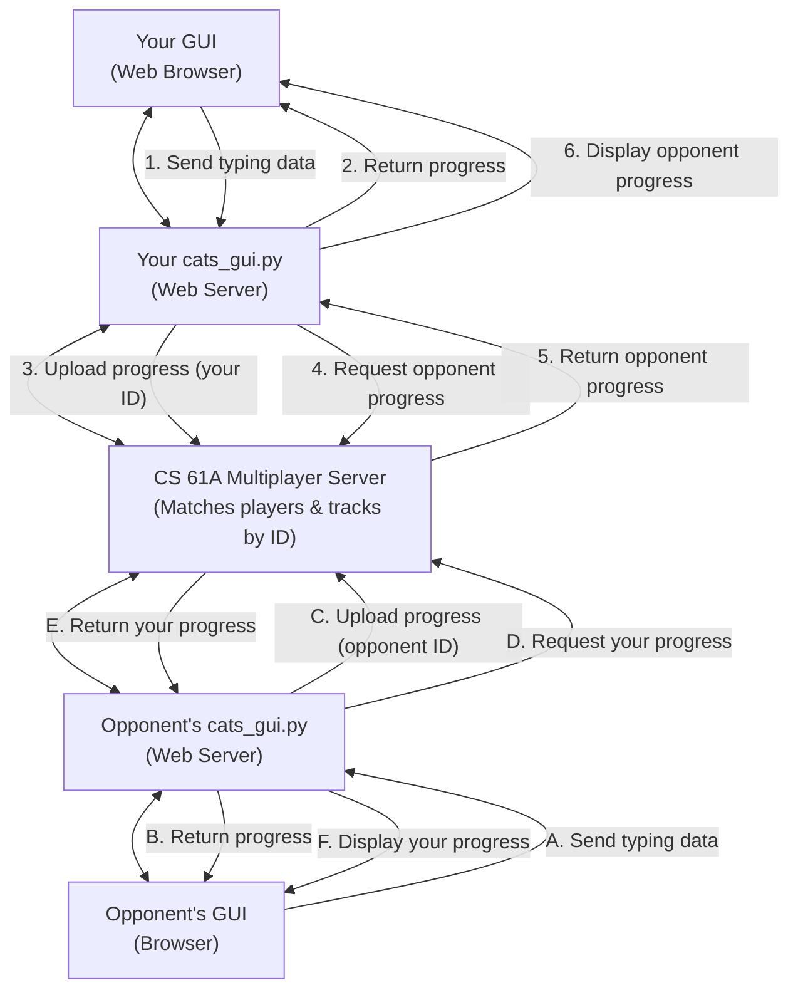

```mermaid
flowchart TD
    %% Main components
    YourGUI["Your GUI\n(Web Browser)"]
    YourServer["Your cats_gui.py\n(Web Server)"]
    MultiServer["CS 61A Multiplayer Server\n(Matches players & tracks by ID)"]
    OpponentServer["Opponent's cats_gui.py\n(Web Server)"]
    OpponentGUI["Opponent's GUI\n(Browser)"]
    
    %% Connections between components
    YourGUI <--> YourServer
    YourServer <--> MultiServer
    MultiServer <--> OpponentServer
    OpponentServer <--> OpponentGUI
    
    %% Main data flows from your perspective
    YourGUI -- "1. Send typing data" --> YourServer
    YourServer -- "2. Return progress" --> YourGUI
    YourServer -- "3. Upload progress (your ID)" --> MultiServer
    YourServer -- "4. Request opponent progress" --> MultiServer
    MultiServer -- "5. Return opponent progress" --> YourServer
    YourServer -- "6. Display opponent progress" --> YourGUI
    
    %% Main data flows from opponent's perspective
    OpponentGUI -- "A. Send typing data" --> OpponentServer
    OpponentServer -- "B. Return progress" --> OpponentGUI
    OpponentServer -- "C. Upload progress (opponent ID)" --> MultiServer
    OpponentServer -- "D. Request your progress" --> MultiServer
    MultiServer -- "E. Return your progress" --> OpponentServer
    OpponentServer -- "F. Display your progress" --> OpponentGUI
```